# 벡터
#### 벡터
방향, 크기를 모두 포함하는 표현 도구이다.
게임에서는 주로 힘, 변위를 표현한다.
보통 2차원, 3차원 벡터를 사용한다.
#### 스칼라
크기의 의미만 있는 표현이다. 벡터에 대비되는 개념으로 방향은 내포하지 않는다. 속도 (방향을 내포)가 벡터라면 속력은 스칼라이다.
스칼라는 벡터를 정의하기 위한 필수 요소이다.
#### 벡터 연산
덧셈 : v1 = (1,2,3), v2 = (4,5,6)  
v1 + v2 = (1+4,2+5,3+6) = (5,7,9)

뺄셈 : v1 = (1,2,3), v2 = (4,5,6)  
v1 - v2 = (1-4,2-5,3-6) = (3,3,3)

스칼라 곱 : k = 2, v = (3,5,2)  
kv = 2(3,5,2) = (3 × 2,5 × 2,2 × 2) = (6,10,4)

#### 내적
두 벡터가 이루는 각이 직각인지 아닌지를 판단할 때 쓰인다.

벡터의 각 성분들끼리 곱한 것을 더한다. 점 (·) 연산자로 표현하므로, 점곱이라고도 불린다. 결과가 스칼라이므로 스칼라곱이라고도 불린다.

v1, v2가 3차원 벡터일 때

v1 · v2 = (v1x × v2x) + (v1y × v2y) + (v1z × v2z)

여기서 결과가 0일 때 두 벡터는 직각을 이룬다.
결과가 0보다 크면, 두 벡터는 예각을 이루고, 0보다 작다면 두 벡터는 둔각을 이룬다.

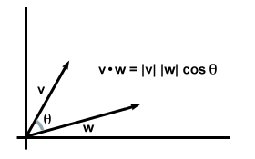

내적의 기하학적 의미는 정의만 보아선 알기 힘들다. 코사인 법칙을 적용해보면 이와 같은 관계를 찾을 수 있다

벡터 v,w에 대해
v·w = ||v||·||w||cosθ

여기서 θ는 두 벡터 사이의 0<=θ<=π (π는 180도, https://ko.wikipedia.org/wiki/%EB%9D%BC%EB%94%94%EC%95%88 참고.)

이 때 v,w가 단위 벡터(길이가 1인 벡터)이면, v·w 는 두 벡터가 이루는 각도 사이의 코사인이다. 즉, v·w = cosθ이다.

#### 내적의 특성
1. 만일 v·w = 0이면, 두 벡터는 직교한다. (∵ cos90˚ = 0)  
2. 만일 v·w > 0이면, 두 벡터 사이의 각도 θ는 예각을 이룬다.   
3. 만일 v·w < 0이면, 두 벡터 사이의 각도 θ는 둔각을 이룬다.

#### 직교투영
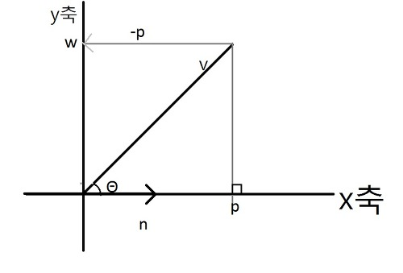  
이 그림에서, p를 내적을 이용해 v와 n으로 표현해보자. (n은 단위벡터)  
그림에서 p = kn을 만족하는 스칼라 k 값이 존재한다.
또, n은 단위 벡터이므로 ||p|| = ||kn|| = |k| ||n|| = |k|이다. (k에 절댓값을 씌워진 이유는, p와 n의 방향이 같기 때문이다.)  
여기서 삼각함수 공식을 적용하면, k = ||v||cosθ가 나온다. (cosθ = ||v||/k 에서 유도됨)  
따라서 p = kn = (||v||cosθ)n이 성립한다. 이때 n은 단위벡터이기 때문에, 다음과 같은 표현이 가능하다.

p = (||v||cosθ)n = (||v|| * 1cosθ)n = (||v|| ||n||cosθ)n = (v·n)n

이 공식에서 k=v·n이라는 사실을 도출해낼 수 있다. 이는 n이 단위벡터일 때 v·n의 기하학적 의미를 말해준다.

이러한 p를 n의 v에 대한 직교투영(orthographic projection)이라 한다. 표기는 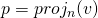 와 같이 한다.

위 그림에서 v가 힘이라면 p는 힘 v 중에 n 방향으로 작용하는 부분이라고 할 수 있다.

여기서, 벡터 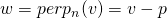는 힘 v중에서 n의 수직 방향으로 진행하는 힘을 의미한다. (perp는 perpendicular[수직]을 뜻함.)

v = p + w임을 보자. v는 두 직교하는 벡터인 p와 w의 합으로 이루어졌다. n이 단위 길이가 아니라면 먼저 n을 정규화시켜 단위 길이로 만들어보자. 투영 공식에서 n을 단위 벡터 n / ||n||으로 만들면 다음과 같이 좀 더 일반화된 공식이 나온다.

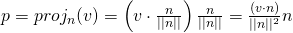

#### 직교화 (그람-슈미트 직교화)

##### 정규직교집합
벡터 집합 {v0,v1,v2,...,v(n-1)}의 모든 벡터가 단위 길이이고 서로 직교일 때 (집합의 모든 벡터가 다른 모든 벡터와 수직임) 이 벡터 집합을 정규직교집합이라 한다.
컴퓨터는 벡터의 성분을 float 성분으로 표현하므로 정밀도 계산에 오차가 생겨 벡터 집합이 정규직교집합에 가깝지만 완전히 정규직교가 아닌 경우도 흔히 생긴다. 그런 벡터 집합을 정규직교집합으로 만드는 작업을 직교화라고 한다.

##### 직교화
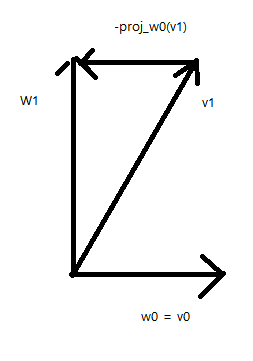

이 2차원 벡터에서 벡터 집합 {v0,v1}을 직교화하여 정규직교집합 {w0,w1}을 얻는 방법이 위의 그림이다.
우선 w0=v0으로 만들어주는 작업을 먼저 수행한 후, v1이 w0과 직교가 되게 하자.  
이를 위해서는, w0 방향으로 진행하는 부분을 v1에서 뺀다.

이 작업을 식으로 나타내자면,

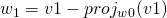 와 같다.

벡터 집합의 벡터들을 서로 직교로 만들었다. 이제 w0과 w1을 정규화시키면 된다.

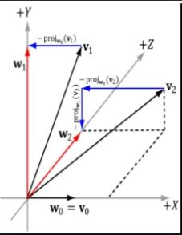

3차원 벡터의 경우도 2차원 벡터때와 같은 원칙을 적용하면 된다. 그저 단계만 많아진다.

우선 w0=v0으로 만들어주는 작업을 먼저 수행한 후, v1이 w0과 직교가 되게 하자.  
이를 위해서는, w0 방향으로 진행하는 부분을 v1에서 뺀다.

이 작업을 식으로 나타내자면,

 와 같다.

v2를 w0,w1에 직교하게 만들어보자. 우선 w0 방향으로 진행하는 부분을 빼주고, 또 w1 방향으로 진행하는 부분을 빼준다.

이 작업을 식으로 나타내자면,

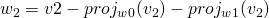 와 같다.

벡터 집합의 벡터들을 서로 직교로 만들었다. 이제 w0, w1, w2을 정규화시키면 된다.

이를 일반화하는 직교화 방법을 그람-슈미트 직교화 라고 한다.

##### 그람-슈미트 직교화 일반화 공정

n개의 벡터 집합 {v0,...,v(n-1)}을 정규직교집합 {w0,...,w(n-1)}로 만드는 과정

1. w0 = v0으로 설정  
2. 1 <= i <= n-1에 대해 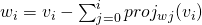로 설정  
3. wi를 정규화. (wi = wi / ||wi||)

###### 요약
집합에서 벡터 vi를 택하고, 직교 벡터 집합에 있는 다른 벡터(w0,w1,...,w(i-1)) 의 방향 부분을 빼서 직교화하고, 그 결과를 직교벡터 집합에 추가시킨다. 모든 벡터가 서로 직교가 될 때까지 반복한 후 집합의 모든 벡터를 정규화시킨다.

#### 외적

또 다른 벡터 곱섹으로 외적이라는 것이 있다. 연산자 × 으로 나타내기에 가위곱이라고도 한다. 내적과는 달리 외적의 결과는 벡터이며, 외적은 오직 3차원 벡터에 대해서만 정의된다. 두 3차원 벡터 u와 v의 외적을 취하면 u,v 모두에게 직교인 또 다른 벡터 w가 나온다. 즉, w,u, w,v는 서로 직교이다.

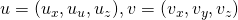 일 때

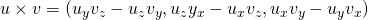  
으로 정의된다.

##### 외적의 특징
교환 법칙이 적용되지 않는다. 즉, u × v != v × u이다.

외적으로 얻는 벡터가 어떤 방향에 있는지는 왼손 엄지 법칙으로 알 수 있다. 손을 총 모양으로 만들어, 첫번째 벡터를 가리키고, 말아쥔 부분을 두번째 벡터를 가리키도록 하면 그 때 엄지손가락을 편 부분이 외적 벡터의 방향이다.
