# 삼각함수
#### 삼각함수가 무엇인가?
'각'에 대한 여러가지 함수이다.
## 들어가기 전에
* * *
#### 삼각비
직각삼각형에서 두 길이의 비이다. (직각삼각형에서만 정의됨)
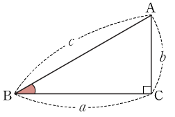

밑변을 a, 높이를 b, 빗변을 c, 각 b를 θ로 두었을 때

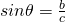

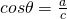

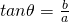

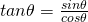

위처럼 정의된다.
* * *
#### 호도법, 라디안(Radian)
라디안은 각의 크기를 나타내는 새로운 단위이다. 라디안으로 각의 크기를 나타내는 방법을 호도법이라고 한다. (도(Degree) 단위로 각을 나타내는 것은 육십분법이라고 한다.) 삼각 함수에서는 라디안이 매우 편리하게 사용된다.
##### 호도법
호의 길이를 이용해 각도를 표시하는 방법이다.

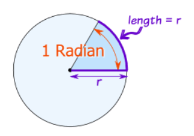

반지름의 길이가 r인 원에서 호의 길이가 r과 같은 호를 잡고 그 각을 θ도라 해보자. 부채꼴의 호의 길이는 중심각에 비례한다.
원의 둘레와 호의 길이에 대한 비례식을 세워보면,

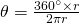

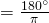

이와 같이 반지름과 부채꼴의 호가 같을 때, 중심각 θ는 항상 일정한 값을 갖는다. 이 일정한 값을 1 라디안이라고 한다.

###### 정리
1 rad 

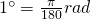

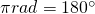
* * *
#### 예시
60도를 호도법으로 표현해보자.

 이므로

----
3 rad를 육십분법으로 표현해보자.

1 rad  1이므로
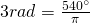
* * *
#### 삼각함수

https://www.youtube.com/watch?v=bTs0DcMxDT8

이 노래 들으면 된다.

듣기 싫을 때를 위해 써보자.

X,Y축으로 이루어진 좌표평면에 원을 그리고, 원 위의 임의의 점을 잡아 원점에서 그 점으로 뻗는 반직선이 있을 때

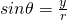

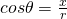

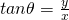

와 같이 정의된다. 이 세가지를 묶어 **삼각함수** 라고 한다.

##### 삼각함수 값의 부호

삼각함수를 정의할 때 원의 점이 어느 사분면에 있는지에 따라 함수값의 부호가 다르다.

제 1사분면의 점은 모든(All) 함수의 부호가 +고

제 2사분면은 sin 함수(싸)만 +고

제 3사분면은 tan 함수(탄)만 +고

제 4사분면은 cos 함수(코)만 +이다.

줄여서 올싸탄코 -> **얼싸안고** 라고 외워보자.

* * *
#### 삼각함수의 성질

피타고라스의 정리에 의해, 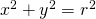 는 성립한다. 이를 이용해 sin, tan, cos 함수간의 관계를 찾을 수 있다.

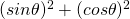

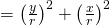

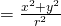

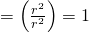

(이다.)

##### 예제 문제

θ가 제 2사분면 위의 각이고 sin θ = 1/2일 때 cos θ과 tan θ를 구해보자.

 이므로

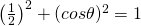

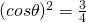

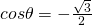

(θ가 제 2사분면 위의 각이므로, cos θ의 값은 음수이다.)

 이므로,

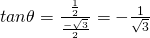

* * *
