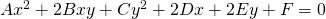
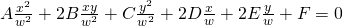
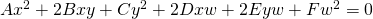

# Homogeneous 좌표계 (동차 좌표계)
#### 동차 좌표계를 쓰는 이유
굳이 직교 좌표계를 냅두고 왜 동차 좌표계를 쓸까? 그 이유는 이 좌표계에 무한의 개념을 포함할 수 있기 때문이다. 무한대의 개념을 사용할 수 있다면 기하학적인 개념의 정립과 계산이 매우 쉬워진다. 이는 곡선과 표면 디자인에서 확실해진다 한다. 컴퓨터 그래픽스의 경우만 봐도 이 동차 좌표계를 사용하지 않고는 곡선 표현이 매우 어려워진다.
#### 동차 좌표계의 표현
두 실수 a,w가 있다고 생각해보고, a/w의 값을 계산해보자. a를 고정시키고 w의 값을 변화시킬 때 w의 값이 감소할 때 a/w의 값은 무한에 가까워진다. 무한대의 표현을 사용하기 위해 두 수가 필요하고 그 두 수를 나눈 값 v가 필요하다. 만약 w가 0이 아니라면 a/w는 정확히 v가 된다. 만일 w가 0이라면 무한대의 값을 (a,0)과 같이 정의할 수 있다. 그러므로 무한대의 개념을 한 쌍의 숫자 (a,w)나 a/w로 나타낼 수 있다.

이를 좌표 평면에 나타내보자. x,y를 각각 x/w, y/w로 치환한다면 함수 f(x,y) = 0은 f(x/w,y/w) = 0이 된다. 만약 이 함수가 다항식이라면 이 함수에 w의 n제곱을 곱해준다면 계수가 정리될 것이다.

이 2차식을 예로 들어보자.  

  

x,y를 각각 x/w, y/w로 치환해준다.

  

각 항을 w^2로 곱해준다.  

  

이 항은 모든 차수가 같다. 즉 균일하므로 동차 좌표계라고 한다.
#### 동차 좌표계에서 xy 좌표계 변환
동차좌표계의 점 (x,y,w)가 있다면  
앞에서 나온 개념에 의해 (x/w,y/w)가 됨을 알 수 있다.  
ex) 동차좌표계의 점 (3,4,5) -> xy좌표계 점 (3/5,4/5)

xy좌표계의 점(x,y)을 동차좌표계에 표현하려면, 그것은 단순히 (x,y,1)이다. 그러나 그 답이 정답이 아니고, 답은 무한하다.
xy평면에서 한 점 (x,y)에 대한 동차좌표는 (xw,yw,w)가 된다. 단, w는 0이 아니다. 따라서 동차좌표는 단 한점으로 변화되지 않는다.
#### OpenGL의 Homogeneous 좌표계
OpenGL에서 행렬 변화 시, 편리한 Homogeneous 좌표계의 벡터를 사용할 때도 있다.

표현 방법은 3차원 벡터를 예로 들자면  
· w == 1 이면 벡터 (x,y,z,1)은 공간에서의 위치이다.  
· w == 0 이면 벡터 (x,y,z,0)은 방향이다.
