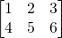
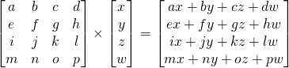
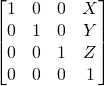
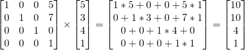

# 변환 행렬 (Translation Matrix)
#### 행렬
행렬(matrix)란 미리 정의해둔 개수의 행(row)들과 열(colums)들을 이용하여 여러 개의 배열을 합쳐놓은 것이다.


ex) 2 x 3 행렬



3D 그래픽스에서는 주로 4x4 행렬을 사용한다. (동차 좌표계를 사용한다. 그 이유는 행렬 계산이 편리하기 때문.)  
이 4x4 행렬은 (x,y,z,w) 버텍스를 변형하게 해준다. 이는 행렬에 버텍스를 곱하여 이루어진다.

행렬 x 버텍스 (반드시 이 순서로 곱해야 한다.) = 변형된 버텍스



직관적으로 알 수 있는 곱셈이라 설명을 생략하겠다.

#### 의사 코드
많은 수학 라이브러리들이 그저 연산자 하나로 이 복잡한 행렬 곱셈을 바로 수행해준다.

C++에서 OpenGL의 glm(헤더 파일)으로 수행하는 법

```C++
glm::mat4 myMatrix;
glm::vec4 myVector;

//myMatrix와 myVector에 요소를 넣어준다 . . .

glm::vec4 transformVector = myMatrix * myVector;
```

OpenGL의 GLSL(쉐이더 언어)의 수행방법
```
mat4 myMatrix;
vec4 myVector;

//myMatrix와 myVector에 요소를 넣어준다 . . .

vec4 transformVector = myMatrix * myVector;
//glm과 매우 비슷하다.
```
* * *
## 평행이동 행렬
평행이동 행렬이란 말 그대로 벡터를 평행 이동 시키는 것을 변환 행렬을 통해 나타낸 것이다.

여기서 x,y,z에 있는 값이 내가 변화시키고자 하는 값이다.



벡터 (5,3,4,1)을 X 방향으로 5, Y 방향으로 7 움직이고 싶다면, 이런 식을 계산한다.



이 계산을 통해 (10,10,4,1) 벡터를 얻었고, w의 값이 1이므로 이 벡터는 위치를 의미한다.
(동차 좌표계 참고. https://github.com/Gengaozo/GameEngineAndGameMathTIL/blob/master/%EC%A2%8C%ED%91%9C%EA%B3%84/Homogeneous/Homogeneous.md)
