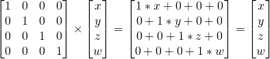
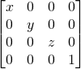
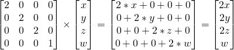
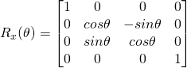
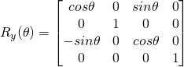
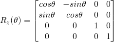

# 변환 행렬 (Translation Matrix)
#### 행렬
행렬(matrix)란 미리 정의해둔 개수의 행(row)들과 열(colums)들을 이용하여 여러 개의 배열을 합쳐놓은 것이다.


ex) 2 x 3 행렬


3D 그래픽스에서는 주로 4x4 행렬을 사용한다. (동차 좌표계를 사용한다. 그 이유는 행렬 계산이 편리하기 때문.)  
이 4x4 행렬은 (x,y,z,w) 버텍스를 변형하게 해준다. 이는 행렬에 버텍스를 곱하여 이루어진다.

행렬 x 버텍스 (반드시 이 순서로 곱해야 한다.) = 변형된 버텍스


직관적으로 알 수 있는 곱셈이라 설명을 생략하겠다.

#### 코드
많은 수학 라이브러리들이 그저 연산자 하나로 이 복잡한 행렬 곱셈을 바로 수행해준다.

C++에서 OpenGL의 glm으로 수행하는 법

```C++
glm::mat4 myMatrix;
glm::vec4 myVector;

//myMatrix와 myVector에 요소를 넣어준다 . . .

glm::vec4 transformVector = myMatrix * myVector;
```

OpenGL의 GLSL(쉐이더 언어)의 수행방법
```
mat4 myMatrix;
vec4 myVector;

//myMatrix와 myVector에 요소를 넣어준다 . . .

vec4 transformVector = myMatrix * myVector;
//glm과 매우 비슷하다.
```
* * *
## 평행이동 행렬
평행이동 행렬이란 말 그대로 벡터를 평행 이동 시키는 것을 변환 행렬을 통해 나타낸 것이다.

여기서 x,y,z에 있는 값이 내가 변화시키고자 하는 값이다.


벡터 (5,3,4,1)을 X 방향으로 5, Y 방향으로 7 움직이고 싶다면, 이런 식을 계산한다.


이 계산을 통해 (10,10,4,1) 벡터를 얻었고, w의 값이 1이므로 이 벡터는 위치를 의미한다.
(동차 좌표계 참고. https://github.com/Gengaozo/GameEngineAndGameMathTIL/blob/master/%EC%A2%8C%ED%91%9C%EA%B3%84/Homogeneous/Homogeneous.md)
#### 코드

C++에서 OpenGL의 glm으로 수행하는 법

```C++
//다른 헤더 파일, <glm/glm.hpp>가 무조건 include되어야함.
include<glm/gtx/transform.hpp>

glm::mat4 myMatrix = glm::translate(glm::mat4(),glm::vec3(5.0f,7.0f,0.0f))
//glm::mat4()는 인스턴스를 스택에 생성하는 생성자이다.
//이를 변환시킨 행렬을 적용시켜 리턴해줘 변수에 할당하는 것.
glm::myVector(5.0f,3.0f,4.0f,1.0f);
glm:mat4 transformedVector = myMatrix * myVector;
```

OpenGL의 glsl(쉐이더 언어)의 수행 방법

```
//이하 동일
glm::transformedVector = myMatrix * myVector
```

## 단위 행렬
간단하다. 그저 버텍스를 곱하면 곱한 버텍스가 나온다. 그러나 이러한 점이 매우 유용한 것이다.



#### 코드
C++에서
```
glm::mat4 myIdentityMatrix = glm::mat4(1.0f);
```

glm::mat4의 생성자에 한 스칼라가 인자로 들어갔다면, 행렬의 대각선 부분에 그 스칼라가 들어가고 나머지는 0으로 초기화된다. 즉, 1을 넣으면 단위 행렬이다.

## 스케일링 행렬 (크기 변환)
매우 쉽다.



벡터를 모든 방향으로 2배 스케일하고 싶다면, 위 행렬의 x,y,z에 2를 넣어주면 된다.



이 때 보통 w는 스케일링되지 않는다. 방향을 스케일링 하는 경우는 거의 없기 때문이다.

스케일링하는 경우는... 나도 몰라.

화면을 렌더링하기 위한 투영 행렬은 가까운 곳과 먼 곳이 필요하다. 이 가까운 곳과 먼 곳의 방향 1로 정규화할 때 w(방향)를 스케일링해주는 것.

https://en.wikipedia.org/wiki/Scaling_(geometry)

이 사이트에 w를 스케일링 할 때 행렬의 연산 과정이 있다.
## 회전 행렬
유도 과정은 https://o-tantk.github.io/posts/derive-rotation-matrix/을 참고.

3차원 공간의 벡터(점) (x,y,z)을 x,y,z 축으로 θ도 회전시키는 행렬을 각각 Rx(θ), Ry(θ), Rz(θ)라 하면 회전 행렬은







#### 코드
C++에서 OpenGL의 glm을 이용한 회전 행렬 구하기
```C++
#include<glm/gtx/transform.hpp>
#include<glm/gtc/matrix_transform.hpp>
glm::vec3 myRotAxis(x,y,z);
glm::rotate(angle,myRotAxis);
```
