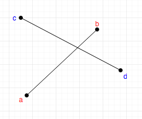
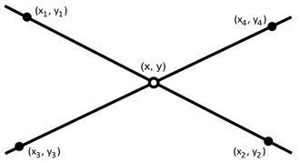
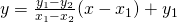
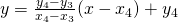
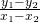

# 게임과 충돌
***
게임에서 충돌을 빼면 섭섭하다.
일반적인 게임에서 플레이어 캐릭터가 걸어다닐 때부터 충돌이 필요하고,
플레이어가 적을 공격했을 때 타격 판정 또한 충돌의 개념이 사용되기 때문이다.
또한 현실에서의 물리 현상을 게임 내에 적용하기 위해서도 충돌의 개념이 꼭 필요하다.

---

## 목차

1. [충돌의 단위](#충돌의-단위)
2. [충돌 판정에 사용하는 형태](#충돌-판정에-사용하는-형태)
3. [스크립팅으로 표현하기](#스크립팅으로-표현하기)
4. [선분 간의 충돌 감지 (2차원)](#선분-간의-충돌-감지-(2차원))

---
### 충돌의 단위

우선 3차원 게임을 예로 들어보자.
3차원 오브젝트의 모형은 보통 폴리곤 (삼각형) 모델로 만든다.
폴리곤은 평면을 여러 개 붙여 만든 물체다.
이 때 **Mesh(메쉬)** 라는 명칭을 접해 본 적도 있을텐데,
이는 3차원 오브젝트 모델을 구성하는 폴리곤들과
정점(Vertexes)들의 집합을 의미한다.

게임 내에서 폴리곤 단위로 충돌 검사를 하는 것을 '메쉬 충돌 검사(Mesh Collision Detection)'
라고 한다. 이는 충돌 검사의 정확성(신뢰성)이 가장 높다.
그러나 근래의 게임의 3d 모델 폴리곤 수는 수천개가 넘어가는 것을 자주 볼 수 있다.
그렇기 때문에 이 수많은 폴리곤으로 충돌 검사를 하는 것은 매우 비용이 많이 들기 때문에 비현실적이다.

그래서 보통 3d 게임에서는 육면체, 원통, 캡슐과 같은 단순한 모형으로 충돌 범위를 간단하게 만드는 경우를 자주 볼 수 있다.
간단한 도형으로 충돌 검사를 하면 3d 모델의 폴리곤을 기준으로 충돌 판정을 하는 것보다 연산량을 대폭 줄일 수 있기 때문이다.
정확성이 다소 떨어지긴 하지만, 게임에 크게 방해가 되지 않는 선에서는 이와 같은 간소화된 충돌 감지를 하기도 한다.
2차원에서도 마찬가지로 폴리곤 충돌 범위 대신 사각형, 원같은 단순화된 충돌 범위를 사용하기도 한다.
***
### 충돌 판정에 사용하는 형태

일단 단순한(낮은 수준) 충돌을 알아보자.

충돌을 감지하는 형태는 기본적으로 세 가지고, 그 특징을 알아보자.

#### **· 선분**
· 두 좌표를 이은 선

· 시작점과 벡터 혹은 시작점과 끝점으로 표현

· 굵기가 없는 선

#### **· 구**
· 중심으로부터 같은 거리(반지름)에 있는 점들의 집합이 이루는 면으로 만든 형태

· 중심과 반지름으로 표현

**· 평면**

· 3차원 공간에 무한히 펼쳐진 평평한 면

· 평면 방정식 (법선 벡터 정보 포함) 으로 표현

· 삼각형일 때는 평면을 범위로 제한

***
#### 스크립팅으로 표현하기
```c++
struct Vector4
{
  float x;
  float y;
  float z;
  float w;  //w == 0일 시 벡터, w == 1일 시 점
}

struct Segment //선분
{
  Vector4 pos;  //시작점
  Vector4 vec;  //벡터 (끝점으로 정의할 수도 있으나 벡터 사용)
}

struct Sphere //구
{
  Vector4 pos;  //중심 좌표
  float r;      //반지름
}

struct Plane  //평면
{
  float a;  //법선 벡터 x성분
  float b;  //법선 벡터 y성분
  float c;  //법선 벡터 z성분
  float d;

  //d는 평면 안의 점 (x,y,z)가 있을 때
  //ax + by + cz + d = 0이 되게 하는 값.

}

struct Triangle
{
  Vector4 pos[3]; //삼각형의 꼭짓점들
  Plane plane;  //삼각형을 포함시킬 평면
}

//Vector4 설정 함수
Vector4 Vector4Set(float x, float y, float z, float w)
{
  Vector4 r;
  r.x = x;
  r.y = y;
  r.z = z;
  r.w = w;
  return r;
}

//프로그래머의 편의를 위해 점, 벡터 함수 따로 만들기
Vector4 Vector4SetVector(float x, float y, float z)
{
  //w가 0일 때 Vector4가 벡터임.
  return Vector4Set(x, y, z, 0f);
}

Vector4 Vector4SetPoint(float x, float y, float z)
{
  //w가 1일 때 Vector4가 점임.
  return Vector4Set(x, y, z, 1f);
}

//주의 : start는 점, end는 벡터여야함.
Segment SegmentSet(Vector4 start, Vector4 end)
{
  Segment r;
  r.pos = start;
  r.vec = end;
  return r;
}

Segment SegmentSet(float px, float py, float pz, float vx, float vy, float vz)
{
  Segment r;
  r.pos = Vector4SetPoint(px, py, pz);
  r.vec = Vector4SetVector(vx, vy, vz);
  return r;
}

//주의 : center는 점이어야함.
Sphere SphereSet(Vetor4 center, float r)
{
  Sphere s;
  s.pos = center;
  s.r = r;
  return s;
}

Sphere SphereSet(float x, float y, float z, float r)
{
  Sphere s;
  s.pos = Vector4SetPoint(x, y, z);
  s.r = r;
  return s;
}

//주의 : normalVector는 벡터, p는 점이어야함.
Plane PlaneSet(Vector4 normal, Vector4 p)
{
  //법선 벡터 정규화해두기
  Vector4 n = Vector4Normalize(normal);

  Plane plane;
  plane.a = n.x;
  plane.b = n.y;
  plane.c = n.c;
  plane.d = -(n.x * p.x + n.y * p,y + n.z * p.z);

  return plane;
}

//세 점을 이용한 평면 설정
Plane PlaneSet(Vector4 p0, Vector4 p1, Vector4 p2)
{
  Vector4 n = Vector4Cross(p0, p1, p2);
  return PlaneSet(n, p0);
}

Triangle TriangleSet(Vector4 p0, Vector4 p1, Vector4 p2)
{
  Plane plane = PlaneSet(p0, p1, p2);

  Triangle r;
  r.pos[0] = p0;
  r.pos[1] = p1;
  r.pos[2] = p2;
  r.plane = plane;
  return r;
}
//삼각형 설정
```

#### 선분 간의 충돌 감지 (2차원)



선분이 충돌하는 경우는 두 가지가 있는데, 두 선분이 교차하는 경우와 두 선분이 겹치는 경우가 있다. 두 가지 경우 모두 결국 그 선분의 직선의 방정식에서 같은 점이 있다는 것을 밝히면 두 선분이 충돌했다는 것을 검출해낼 수 있다.



선분 A는 한 점이 (x1, y1)이고 또 다른 한 점이 (x2, y2), 선분 B는 시작점이 (x3, y3), 또 다른 한 점이 (x4, y4)라고 했을 때 이 상태를 직선 방정식으로 나타낼 수 있다.

선분 A : 

선분 B : 

여기서  꼴의 부분이 바로 이 직선의 **기울기** 이다.
